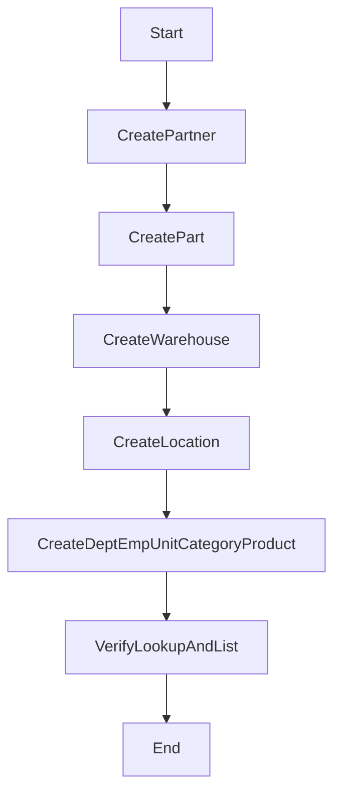

# 主檔資料建檔流程

## 流程目的與邊界

建立供流程使用的基礎主檔：料號、交易夥伴、倉庫、庫位、部門、員工、單位、分類、產品。

## 前置資料

- Tenant（例如 `DEV-INNOVA`）
- 權限：`ADMIN`

## 流程圖



## API 契約（範例）

- `POST /partner`
- `POST /part`
- `POST /warehouse`
- `POST /location`

Request（以 `part` 為例）：

```json
{
  "code": "OC-001",
  "name": "Oil Cooler",
  "uom": "PCS",
  "isActive": true
}
```

## 資料關聯重點

- `location.warehouseId -> warehouse.id`
- 其他交易流程只使用 `id` 做關聯，UI 顯示 `CODE+NAME`

## 完整範例程式碼（Controller + Service）

```ts
// master-data-flow.controller.ts
@Controller('nx00/master-flow')
@UseGuards(JwtAuthGuard, RolesGuard)
@Roles('ADMIN')
export class MasterDataFlowController {
  constructor(private readonly svc: MasterDataFlowService) {}

  @Post('bootstrap')
  async bootstrap(@Body() body: BootstrapMasterBody, @Req() req: any) {
    return this.svc.bootstrap(body, {
      actorUserId: req?.user?.sub,
      ipAddr: req?.ip ?? null,
      userAgent: req?.headers?.['user-agent'] ?? null,
    });
  }
}

// master-data-flow.service.ts
@Injectable()
export class MasterDataFlowService {
  constructor(
    private readonly prisma: PrismaService,
    private readonly audit: AuditLogService,
  ) {}

  async bootstrap(body: BootstrapMasterBody, ctx: Ctx) {
    return this.prisma.$transaction(async (tx) => {
      const partner = await tx.nx00Partner.upsert({
        where: { code: body.supplier.code },
        update: { name: body.supplier.name, updatedBy: ctx.actorUserId ?? null },
        create: {
          code: body.supplier.code,
          name: body.supplier.name,
          partnerType: 'SUPP',
          createdBy: ctx.actorUserId ?? null,
          updatedBy: ctx.actorUserId ?? null,
        },
      });

      const part = await tx.nx00Part.upsert({
        where: { code: body.part.code },
        update: { name: body.part.name, updatedBy: ctx.actorUserId ?? null },
        create: {
          code: body.part.code,
          name: body.part.name,
          uom: body.part.uom ?? 'PCS',
          createdBy: ctx.actorUserId ?? null,
          updatedBy: ctx.actorUserId ?? null,
        },
      });

      const warehouse = await tx.nx00Warehouse.upsert({
        where: { code: body.warehouse.code },
        update: { name: body.warehouse.name, updatedBy: ctx.actorUserId ?? null },
        create: {
          code: body.warehouse.code,
          name: body.warehouse.name,
          createdBy: ctx.actorUserId ?? null,
          updatedBy: ctx.actorUserId ?? null,
        },
      });

      const location = await tx.nx00Location.upsert({
        where: { code: body.location.code },
        update: { name: body.location.name, warehouseId: warehouse.id, updatedBy: ctx.actorUserId ?? null },
        create: {
          warehouseId: warehouse.id,
          code: body.location.code,
          name: body.location.name,
          createdBy: ctx.actorUserId ?? null,
          updatedBy: ctx.actorUserId ?? null,
        },
      });

      await this.audit.write({
        actorUserId: ctx.actorUserId ?? null,
        moduleCode: 'NX00',
        action: 'BOOTSTRAP',
        entityTable: 'nx00_master_flow',
        entityId: warehouse.id,
        entityCode: warehouse.code,
        summary: 'Bootstrap master data',
        afterData: { partner, part, warehouse, location },
        ipAddr: ctx.ipAddr ?? null,
        userAgent: ctx.userAgent ?? null,
      });

      return { partner, part, warehouse, location };
    });
  }
}
```

## 例外處理與稽核

- `code` 重覆：走 upsert 覆蓋可更新欄位。
- 外鍵不存在：回傳 `400 BadRequest`。
- 寫入失敗：整筆交易回滾。

## 測試案例

- 可建立全新主檔。
- 第二次執行可 idempotent 更新。
- `location` 指向不存在 `warehouse` 時失敗。

