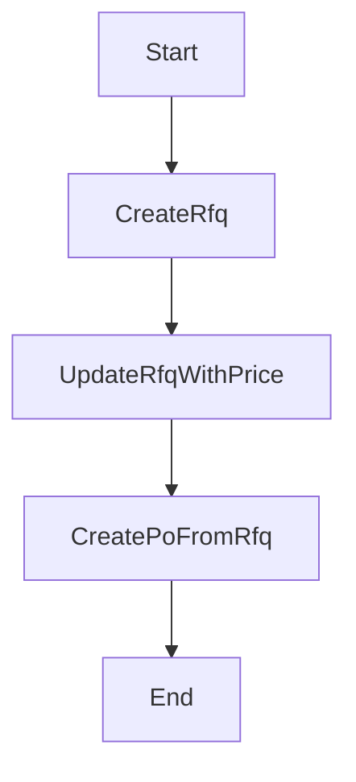

# 採購流程（詢價單 -> 採購單）

## 流程目的與邊界

針對補貨或專案需求，先建立詢價單（R），確認成本後轉採購單（P）。

## 前置資料

- 供應商主檔（partnerType: `SUPP/BOTH`）
- 料號主檔
- 倉庫與庫位主檔

## 流程圖



## 狀態機

- RFQ: `D -> R -> C/V`
- PO: `D -> P/C`

## API 契約

- `POST /nx01/rfq`
- `PUT /nx01/rfq/:id`
- `POST /nx01/rfq/:id/to-po`

## 完整範例程式碼（對齊現況）

```ts
@Injectable()
export class ProcurementFlowService {
  constructor(
    private readonly prisma: PrismaService,
    private readonly audit: AuditLogService,
  ) {}

  async createRfq(body: CreateRfqBody, ctx: Ctx) {
    if (!body.docNo || !body.rfqDate || !body.supplierId || !body.items?.length) {
      throw new BadRequestException('required fields missing');
    }
    const supplier = await this.prisma.nx00Partner.findUnique({ where: { id: body.supplierId } });
    if (!supplier) throw new BadRequestException('supplier not found');

    const parts = await this.prisma.nx00Part.findMany({
      where: { id: { in: body.items.map((x) => x.partId) } },
      select: { id: true, code: true, name: true },
    });
    const partById = new Map(parts.map((p) => [p.id, p]));
    for (const it of body.items) if (!partById.has(it.partId)) throw new BadRequestException(`part not found: ${it.partId}`);

    const status = body.items.every((x) => x.unitPrice != null) ? 'R' : 'D';
    const created = await this.prisma.nx01Rfq.create({
      data: {
        docNo: body.docNo,
        rfqDate: new Date(body.rfqDate),
        supplierId: body.supplierId,
        status,
        currency: body.currency ?? 'TWD',
        createdBy: ctx.actorUserId ?? null,
        updatedBy: ctx.actorUserId ?? null,
        items: {
          create: body.items.map((it, idx) => {
            const p = partById.get(it.partId)!;
            return {
              lineNo: idx + 1,
              partId: p.id,
              partNo: p.code,
              partName: p.name,
              qty: it.qty as any,
              unitPrice: it.unitPrice != null ? (String(it.unitPrice) as any) : null,
              leadTimeDays: it.leadTimeDays ?? null,
              currency: body.currency ?? 'TWD',
              status,
            };
          }),
        },
      },
      include: { items: { orderBy: [{ lineNo: 'asc' }] } },
    });

    await this.audit.write({
      actorUserId: ctx.actorUserId ?? null,
      moduleCode: 'NX01',
      action: 'CREATE',
      entityTable: 'nx01_rfq',
      entityId: created.id,
      entityCode: created.docNo,
      summary: `Create RFQ ${created.docNo}`,
      afterData: created,
      ipAddr: ctx.ipAddr ?? null,
      userAgent: ctx.userAgent ?? null,
    });
    return created;
  }

  async createPoFromRfq(rfqId: string, body: ToPoFromRfqBody, ctx: Ctx) {
    const rfq = await this.prisma.nx01Rfq.findUnique({ where: { id: rfqId }, include: { items: true } });
    if (!rfq) throw new NotFoundException('RFQ not found');
    if (rfq.status !== 'R') throw new BadRequestException('RFQ must be REPLIED');
    if (!body.warehouseId) throw new BadRequestException('warehouseId is required');

    const po = await this.prisma.$transaction(async (tx) => {
      const created = await tx.nx01Po.create({
        data: {
          docNo: body.docNo,
          poDate: new Date(body.poDate),
          supplierId: rfq.supplierId,
          rfqId: rfq.id,
          status: 'D',
          currency: body.currency ?? rfq.currency ?? 'TWD',
          createdBy: ctx.actorUserId ?? null,
          updatedBy: ctx.actorUserId ?? null,
          items: {
            create: rfq.items.map((it, idx) => ({
              lineNo: idx + 1,
              partId: it.partId,
              partNo: it.partNo,
              partName: it.partName,
              warehouseId: body.warehouseId,
              locationId: body.locationId ?? null,
              qty: it.qty,
              unitCost: (it.unitPrice ?? (0 as any)) as any,
              lineAmount: ((it.unitPrice ?? (0 as any)) as any).mul(it.qty),
              remark: null,
            })),
          },
        },
        include: { items: true },
      });
      await tx.nx01Rfq.update({ where: { id: rfq.id }, data: { status: 'C', updatedBy: ctx.actorUserId ?? null } });
      return created;
    });

    return po;
  }
}
```

## 測試案例

- RFQ 建立成功，明細快照正確。
- RFQ（R）可轉 PO；非 R 狀態不可轉。
- 轉 PO 後 RFQ 狀態變 `C`。

