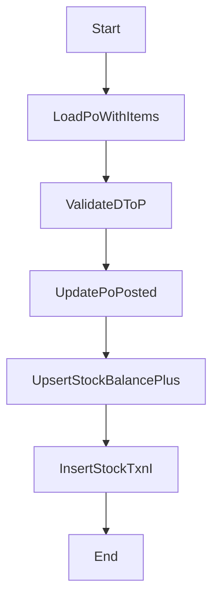

# 進貨/入庫流程（採購單過帳）

## 流程目的與邊界

採購單（P）在到貨後執行過帳，將庫存寫入 `nx09_stock_balance`，並新增 `nx09_stock_txn` 入庫台帳。

## 流程圖



## 狀態機

- PO: `D -> P`
- 已過帳不得重複過帳（若允許沖回需另建反向流程）

## API 契約

- `POST /nx01/po/:id/post`

## 完整範例程式碼（對齊現況）

```ts
@Injectable()
export class InboundFlowService {
  constructor(
    private readonly prisma: PrismaService,
    private readonly audit: AuditLogService,
  ) {}

  async postPo(poId: string, ctx: Ctx) {
    const po = await this.prisma.nx01Po.findUnique({
      where: { id: poId },
      include: { items: true },
    });
    if (!po) throw new NotFoundException('PO not found');
    if (po.status !== 'D') throw new BadRequestException('Only DRAFT PO can be posted');

    const result = await this.prisma.$transaction(async (tx) => {
      const tenantId =
        po.tenantId ??
        (await tx.nx99Tenant.findUnique({ where: { code: 'DEV-INNOVA' }, select: { id: true } }))?.id;
      if (!tenantId) throw new BadRequestException('tenantId is required');

      const posted = await tx.nx01Po.update({
        where: { id: po.id },
        data: {
          status: 'P',
          postedAt: new Date(),
          postedBy: ctx.actorUserId ?? null,
          updatedBy: ctx.actorUserId ?? null,
        },
      });

      for (const it of po.items) {
        const bal = await tx.nx09StockBalance.findFirst({
          where: { tenantId, warehouseId: it.warehouseId, partId: it.partId },
          select: { id: true, qty: true },
        });

        const zero = it.qty.mul(0 as any);
        const beforeQty = bal?.qty ?? zero;
        const afterQty = beforeQty.add(it.qty);

        if (bal) {
          await tx.nx09StockBalance.update({
            where: { id: bal.id },
            data: { qty: afterQty, updatedBy: ctx.actorUserId ?? null },
          });
        } else {
          await tx.nx09StockBalance.create({
            data: {
              tenantId,
              warehouseId: it.warehouseId,
              partId: it.partId,
              qty: it.qty,
              createdBy: ctx.actorUserId ?? null,
              updatedBy: ctx.actorUserId ?? null,
            },
          });
        }

        await tx.nx09StockTxn.create({
          data: {
            tenantId,
            txnType: 'I',
            refType: 'PO',
            refId: po.id,
            partId: it.partId,
            warehouseId: it.warehouseId,
            qtyDelta: it.qty,
            beforeQty,
            afterQty,
            remark: it.remark ?? null,
            createdBy: ctx.actorUserId ?? null,
            updatedBy: ctx.actorUserId ?? null,
          },
        });
      }

      return posted;
    });

    await this.audit.write({
      actorUserId: ctx.actorUserId ?? null,
      moduleCode: 'NX01',
      action: 'POST',
      entityTable: 'nx01_po',
      entityId: result.id,
      entityCode: result.docNo,
      summary: `Post PO ${result.docNo}`,
      afterData: result,
      ipAddr: ctx.ipAddr ?? null,
      userAgent: ctx.userAgent ?? null,
    });

    return result;
  }
}
```

## 例外處理

- PO 不存在：`404`
- PO 非 `D`：`400`
- 缺 tenant：`400`

## 測試案例

- 過帳後 `status=P`、`postedAt` 有值。
- `stock_balance` qty 增加。
- `stock_txn` 產生 `txnType=I`。

