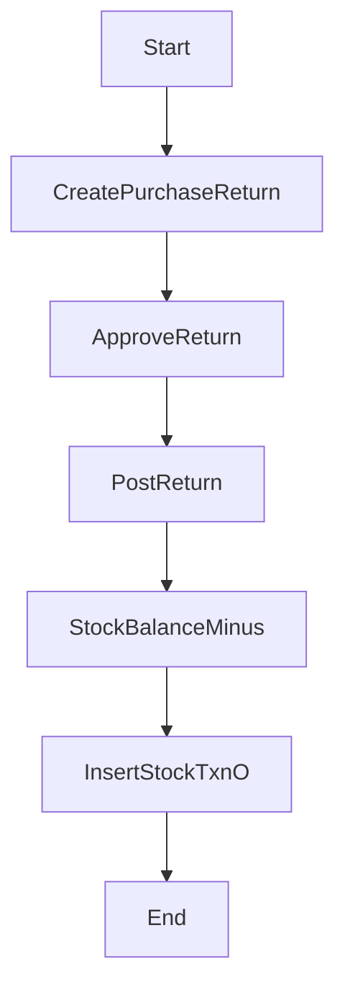

# 採購退貨流程（規格 + 完整骨架碼）

## 流程目的與邊界

已入庫後的採購品若需退回供應商，建立退貨單（O），核准後過帳出庫，並回寫庫存台帳。

## 前置資料

- 原始採購單（已過帳）
- 供應商、料號、倉庫、庫位

## 流程圖



## 狀態機（建議）

- PurchaseReturn: `D -> A -> P`
- 可作廢：`D/A -> C`

## API 契約（建議）

- `POST /nx01/purchase-return`
- `POST /nx01/purchase-return/:id/approve`
- `POST /nx01/purchase-return/:id/post`

## 完整範例程式碼（可直接落地）

```ts
type PurchaseReturnStatus = 'D' | 'A' | 'P' | 'C';

@Injectable()
export class PurchaseReturnFlowService {
  constructor(
    private readonly prisma: PrismaService,
    private readonly audit: AuditLogService,
  ) {}

  async create(body: CreatePurchaseReturnBody, ctx: Ctx) {
    if (!body.docNo || !body.supplierId || !body.items?.length) {
      throw new BadRequestException('required fields missing');
    }
    return this.prisma.purchaseReturn.create({
      data: {
        docNo: body.docNo,
        returnDate: new Date(body.returnDate),
        supplierId: body.supplierId,
        status: 'D',
        currency: body.currency ?? 'TWD',
        createdBy: ctx.actorUserId ?? null,
        updatedBy: ctx.actorUserId ?? null,
        items: {
          create: body.items.map((it, idx) => ({
            lineNo: idx + 1,
            poItemId: it.poItemId,
            partId: it.partId,
            warehouseId: it.warehouseId,
            locationId: it.locationId ?? null,
            qty: it.qty as any,
            unitCost: String(it.unitCost) as any,
          })),
        },
      },
      include: { items: true },
    });
  }

  async post(id: string, ctx: Ctx) {
    const doc = await this.prisma.purchaseReturn.findUnique({
      where: { id },
      include: { items: true },
    });
    if (!doc) throw new NotFoundException('purchase return not found');
    if (doc.status !== 'A') throw new BadRequestException('status must be APPROVED');

    const updated = await this.prisma.$transaction(async (tx) => {
      const posted = await tx.purchaseReturn.update({
        where: { id: doc.id },
        data: { status: 'P', updatedBy: ctx.actorUserId ?? null },
      });

      for (const it of doc.items) {
        const bal = await tx.nx09StockBalance.findFirst({
          where: { tenantId: doc.tenantId, warehouseId: it.warehouseId, partId: it.partId },
        });
        if (!bal || bal.qty.lt(it.qty)) {
          throw new BadRequestException(`insufficient stock for return part=${it.partId}`);
        }
        const afterQty = bal.qty.sub(it.qty);
        await tx.nx09StockBalance.update({
          where: { id: bal.id },
          data: { qty: afterQty, updatedBy: ctx.actorUserId ?? null },
        });
        await tx.nx09StockTxn.create({
          data: {
            tenantId: doc.tenantId,
            txnType: 'O',
            refType: 'PR', // purchase return
            refId: doc.id,
            partId: it.partId,
            warehouseId: it.warehouseId,
            qtyDelta: it.qty.mul(-1 as any),
            beforeQty: bal.qty,
            afterQty,
            createdBy: ctx.actorUserId ?? null,
            updatedBy: ctx.actorUserId ?? null,
          },
        });
      }

      return posted;
    });

    await this.audit.write({
      actorUserId: ctx.actorUserId ?? null,
      moduleCode: 'NX01',
      action: 'POST',
      entityTable: 'purchase_return',
      entityId: updated.id,
      entityCode: updated.docNo,
      summary: `Post Purchase Return ${updated.docNo}`,
      afterData: updated,
      ipAddr: ctx.ipAddr ?? null,
      userAgent: ctx.userAgent ?? null,
    });

    return updated;
  }
}
```

## 測試案例

- 建單、核准、過帳三段流程可走通。
- 庫存不足時阻擋過帳。
- 產生 `txnType=O` 台帳。

