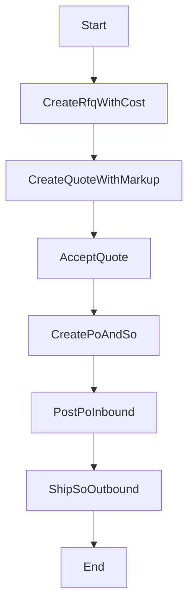

# 銷售流程（詢價單 + 報價單 -> 成交 -> 採購單 + 銷貨單 -> 出貨）

## 流程目的與邊界

客戶詢問缺貨品時，先向供應商取得成本，再對客報價，成交後自動建立採購單與銷貨單，最後執行出貨。

## 流程圖



## 狀態機

- QUOTE: `D -> S -> A/C`
- SO: `D -> R -> S -> X`（或取消）

## API 契約（現況）

- `POST /nx03/quote`
- `POST /nx03/quote/:id/accept`
- `POST /nx03/sales-order/:id/ship`

## 完整範例程式碼（對齊現況）

```ts
@Injectable()
export class SalesFlowService {
  constructor(
    private readonly prisma: PrismaService,
    private readonly audit: AuditLogService,
  ) {}

  async createQuote(body: CreateQuoteBody, ctx: Ctx) {
    const rfq = await this.prisma.nx01Rfq.findUnique({ where: { id: body.rfqId }, include: { items: true } });
    if (!rfq) throw new NotFoundException('RFQ not found');
    if (!body.customerId || !body.items?.length) throw new BadRequestException('required fields missing');

    const markupValue = Number(body.markupValue);
    if (!Number.isFinite(markupValue)) throw new BadRequestException('invalid markupValue');

    const rfqItems = rfq.items.filter((x) => body.items.some((it) => it.rfqItemId === x.id));
    for (const it of rfqItems) if (it.unitPrice == null) throw new BadRequestException('RFQ unitPrice required');

    const quote = await this.prisma.$transaction(async (tx) => {
      const tenantId = rfq.tenantId ?? (await tx.nx99Tenant.findUnique({ where: { code: 'DEV-INNOVA' } }))?.id;
      if (!tenantId) throw new BadRequestException('tenant missing');

      const header = await tx.nx07Quote.create({
        data: {
          tenantId,
          docNo: body.docNo,
          quoteDate: new Date(body.quoteDate),
          customerId: body.customerId,
          rfqId: rfq.id,
          status: 'D',
          currency: body.currency ?? 'TWD',
          createdBy: ctx.actorUserId ?? null,
          updatedBy: ctx.actorUserId ?? null,
        },
      });

      await tx.nx07QuoteItem.createMany({
        data: rfqItems.map((it, idx) => {
          const cost = Number(it.unitPrice!.toString());
          const unitPrice = body.markupType === 'P' ? cost * (1 + markupValue / 100) : cost + markupValue;
          const req = body.items.find((x) => x.rfqItemId === it.id)!;
          return {
            tenantId,
            quoteId: header.id,
            lineNo: idx + 1,
            rfqItemId: it.id,
            partId: it.partId,
            partNo: it.partNo,
            partName: it.partName,
            qty: String(req.qty) as any,
            unitCost: it.unitPrice!.toString() as any,
            unitPrice: unitPrice.toFixed(4) as any,
            markupType: body.markupType,
            markupValue: markupValue.toFixed(4) as any,
            currency: body.currency ?? 'TWD',
            leadTimeDays: it.leadTimeDays,
          };
        }),
      });

      return tx.nx07Quote.findUnique({ where: { id: header.id }, include: { items: true } });
    });

    return quote;
  }

  async acceptQuote(quoteId: string, body: AcceptQuoteBody, ctx: Ctx) {
    const quote = await this.prisma.nx07Quote.findUnique({ where: { id: quoteId }, include: { items: true, rfq: true } });
    if (!quote) throw new NotFoundException('Quote not found');
    if (quote.status !== 'D' && quote.status !== 'S') throw new BadRequestException('invalid quote status');

    return this.prisma.$transaction(async (tx) => {
      const po = await tx.nx01Po.create({
        data: {
          tenantId: quote.tenantId,
          docNo: body.poDocNo,
          poDate: new Date(body.poDate),
          supplierId: quote.rfq?.supplierId!,
          rfqId: quote.rfqId,
          status: 'D',
          currency: quote.currency,
          createdBy: ctx.actorUserId ?? null,
          updatedBy: ctx.actorUserId ?? null,
        },
      });

      await tx.nx01PoItem.createMany({
        data: quote.items.map((it, idx) => ({
          tenantId: quote.tenantId,
          poId: po.id,
          lineNo: idx + 1,
          partId: it.partId,
          partNo: it.partNo,
          partName: it.partName,
          warehouseId: body.warehouseId,
          locationId: body.locationId ?? null,
          qty: it.qty,
          unitCost: it.unitCost,
          lineAmount: it.qty.mul(it.unitCost),
        })),
      });

      const so = await tx.nx08SalesOrder.create({
        data: {
          tenantId: quote.tenantId,
          docNo: body.soDocNo,
          soDate: new Date(body.soDate),
          customerId: quote.customerId,
          quoteId: quote.id,
          status: 'R',
          currency: quote.currency,
          createdBy: ctx.actorUserId ?? null,
          updatedBy: ctx.actorUserId ?? null,
        },
      });

      await tx.nx08SalesOrderItem.createMany({
        data: quote.items.map((it, idx) => ({
          tenantId: quote.tenantId,
          salesOrderId: so.id,
          lineNo: idx + 1,
          quoteItemId: it.id,
          partId: it.partId,
          partNo: it.partNo,
          partName: it.partName,
          qty: it.qty,
          unitPrice: it.unitPrice,
          warehouseId: body.warehouseId,
          locationId: body.locationId ?? null,
        })),
      });

      await tx.nx07Quote.update({ where: { id: quote.id }, data: { status: 'A', updatedBy: ctx.actorUserId ?? null } });
      if (quote.rfqId) await tx.nx01Rfq.update({ where: { id: quote.rfqId }, data: { status: 'C', updatedBy: ctx.actorUserId ?? null } });

      return { quoteId: quote.id, poId: po.id, salesOrderId: so.id, poDocNo: po.docNo, soDocNo: so.docNo };
    });
  }
}
```

## 測試案例

- 建立報價單會依 markup 計算售價快照。
- Accept 成功同時建立 PO/SO。
- SO 出貨時若庫存不足會阻擋。

