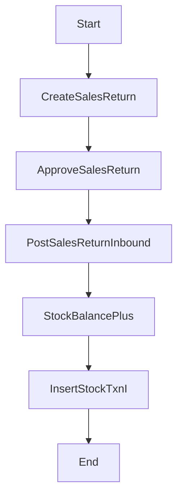

# 銷退流程（規格 + 完整骨架碼）

## 流程目的與邊界

客戶退貨時建立銷退單（C），核准後過帳入庫，並可連動折讓/應收調整（財務段可後續擴充）。

## 流程圖



## 狀態機（建議）

- SalesReturn: `D -> A -> P`
- 可作廢：`D/A -> C`

## API 契約（建議）

- `POST /nx03/sales-return`
- `POST /nx03/sales-return/:id/approve`
- `POST /nx03/sales-return/:id/post`

## 完整範例程式碼

```ts
@Injectable()
export class SalesReturnFlowService {
  constructor(
    private readonly prisma: PrismaService,
    private readonly audit: AuditLogService,
  ) {}

  async create(body: CreateSalesReturnBody, ctx: Ctx) {
    if (!body.docNo || !body.customerId || !body.items?.length) {
      throw new BadRequestException('required fields missing');
    }
    return this.prisma.salesReturn.create({
      data: {
        docNo: body.docNo,
        returnDate: new Date(body.returnDate),
        customerId: body.customerId,
        status: 'D',
        currency: body.currency ?? 'TWD',
        createdBy: ctx.actorUserId ?? null,
        updatedBy: ctx.actorUserId ?? null,
        items: {
          create: body.items.map((it, idx) => ({
            lineNo: idx + 1,
            soItemId: it.soItemId,
            partId: it.partId,
            warehouseId: it.warehouseId,
            locationId: it.locationId ?? null,
            qty: it.qty as any,
            unitPrice: String(it.unitPrice) as any,
          })),
        },
      },
      include: { items: true },
    });
  }

  async post(id: string, ctx: Ctx) {
    const doc = await this.prisma.salesReturn.findUnique({ where: { id }, include: { items: true } });
    if (!doc) throw new NotFoundException('sales return not found');
    if (doc.status !== 'A') throw new BadRequestException('status must be APPROVED');

    const updated = await this.prisma.$transaction(async (tx) => {
      const posted = await tx.salesReturn.update({
        where: { id: doc.id },
        data: { status: 'P', updatedBy: ctx.actorUserId ?? null },
      });

      for (const it of doc.items) {
        const bal = await tx.nx09StockBalance.findFirst({
          where: { tenantId: doc.tenantId, warehouseId: it.warehouseId, partId: it.partId },
          select: { id: true, qty: true },
        });

        const zero = it.qty.mul(0 as any);
        const beforeQty = bal?.qty ?? zero;
        const afterQty = beforeQty.add(it.qty);

        if (bal) {
          await tx.nx09StockBalance.update({
            where: { id: bal.id },
            data: { qty: afterQty, updatedBy: ctx.actorUserId ?? null },
          });
        } else {
          await tx.nx09StockBalance.create({
            data: {
              tenantId: doc.tenantId,
              warehouseId: it.warehouseId,
              partId: it.partId,
              qty: it.qty,
              createdBy: ctx.actorUserId ?? null,
              updatedBy: ctx.actorUserId ?? null,
            },
          });
        }

        await tx.nx09StockTxn.create({
          data: {
            tenantId: doc.tenantId,
            txnType: 'I',
            refType: 'SR',
            refId: doc.id,
            partId: it.partId,
            warehouseId: it.warehouseId,
            qtyDelta: it.qty,
            beforeQty,
            afterQty,
            createdBy: ctx.actorUserId ?? null,
            updatedBy: ctx.actorUserId ?? null,
          },
        });
      }
      return posted;
    });

    await this.audit.write({
      actorUserId: ctx.actorUserId ?? null,
      moduleCode: 'NX03',
      action: 'POST',
      entityTable: 'sales_return',
      entityId: updated.id,
      entityCode: updated.docNo,
      summary: `Post Sales Return ${updated.docNo}`,
      afterData: updated,
      ipAddr: ctx.ipAddr ?? null,
      userAgent: ctx.userAgent ?? null,
    });

    return updated;
  }
}
```

## 測試案例

- 建立/核准/過帳路徑可成功。
- 過帳後 `stock_balance` 增加，`stock_txn` 為 `I`。
- 同單不可重複過帳。

