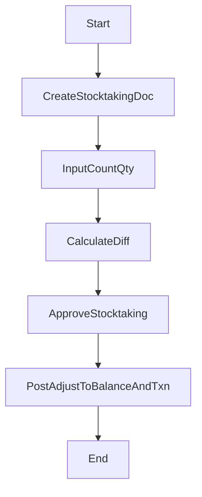

# 盤點流程（規格 + 完整骨架碼）

## 流程目的與邊界

定期盤點實際庫存，產生差異並過帳修正庫存餘額與台帳。

## 流程圖



## 狀態機（建議）

- Stocktaking: `D -> A -> P`
- 可作廢：`D/A -> C`

## API 契約（建議）

- `POST /nx09/stocktaking`
- `PUT /nx09/stocktaking/:id/items`
- `POST /nx09/stocktaking/:id/approve`
- `POST /nx09/stocktaking/:id/post`

## 完整範例程式碼

```ts
@Injectable()
export class StocktakingFlowService {
  constructor(private readonly prisma: PrismaService, private readonly audit: AuditLogService) {}

  async post(id: string, ctx: Ctx) {
    const doc = await this.prisma.stocktaking.findUnique({ where: { id }, include: { items: true } });
    if (!doc) throw new NotFoundException('stocktaking not found');
    if (doc.status !== 'A') throw new BadRequestException('status must be APPROVED');

    const posted = await this.prisma.$transaction(async (tx) => {
      for (const it of doc.items) {
        const bal = await tx.nx09StockBalance.findFirst({
          where: { tenantId: doc.tenantId, warehouseId: it.warehouseId, partId: it.partId },
          select: { id: true, qty: true },
        });
        const zero = (it.countQty as any).mul(0 as any);
        const systemQty = bal?.qty ?? zero;
        const diffQty = (it.countQty as any).sub(systemQty);
        const afterQty = (it.countQty as any);

        if (bal) {
          await tx.nx09StockBalance.update({
            where: { id: bal.id },
            data: { qty: afterQty, updatedBy: ctx.actorUserId ?? null },
          });
        } else {
          await tx.nx09StockBalance.create({
            data: {
              tenantId: doc.tenantId,
              warehouseId: it.warehouseId,
              partId: it.partId,
              qty: afterQty,
              createdBy: ctx.actorUserId ?? null,
              updatedBy: ctx.actorUserId ?? null,
            },
          });
        }

        if (!diffQty.eq(0 as any)) {
          await tx.nx09StockTxn.create({
            data: {
              tenantId: doc.tenantId,
              txnType: diffQty.gt(0 as any) ? 'I' : 'O',
              refType: 'STK',
              refId: doc.id,
              partId: it.partId,
              warehouseId: it.warehouseId,
              qtyDelta: diffQty,
              beforeQty: systemQty,
              afterQty,
              remark: 'stocktaking adjustment',
              createdBy: ctx.actorUserId ?? null,
              updatedBy: ctx.actorUserId ?? null,
            },
          });
        }
      }

      return tx.stocktaking.update({
        where: { id: doc.id },
        data: { status: 'P', postedAt: new Date(), updatedBy: ctx.actorUserId ?? null },
      });
    });

    await this.audit.write({
      actorUserId: ctx.actorUserId ?? null,
      moduleCode: 'NX09',
      action: 'POST',
      entityTable: 'stocktaking',
      entityId: posted.id,
      entityCode: posted.docNo,
      summary: `Post Stocktaking ${posted.docNo}`,
      afterData: posted,
      ipAddr: ctx.ipAddr ?? null,
      userAgent: ctx.userAgent ?? null,
    });

    return posted;
  }
}
```

## 測試案例

- 差異為正/負都可正確產生對應 `txnType`。
- `stock_balance` 最終等於盤點數。
- 未核准不得過帳。

