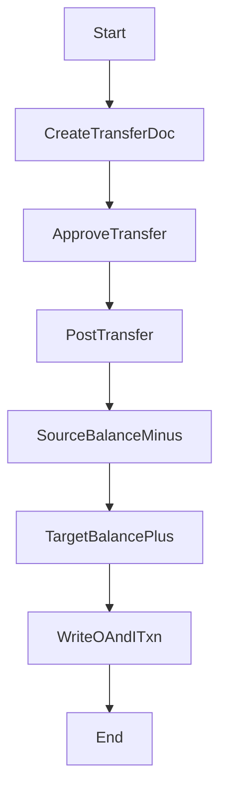

# 調撥流程（規格 + 完整骨架碼）

## 流程目的與邊界

在倉庫/庫位之間移轉庫存。過帳時同時寫入一筆出庫與一筆入庫台帳（同一調撥單）。

## 流程圖



## 狀態機（建議）

- Transfer: `D -> A -> P`
- 可作廢：`D/A -> C`

## API 契約（建議）

- `POST /nx09/transfer`
- `POST /nx09/transfer/:id/approve`
- `POST /nx09/transfer/:id/post`

## 完整範例程式碼

```ts
@Injectable()
export class TransferFlowService {
  constructor(private readonly prisma: PrismaService, private readonly audit: AuditLogService) {}

  async post(id: string, ctx: Ctx) {
    const doc = await this.prisma.transfer.findUnique({ where: { id }, include: { items: true } });
    if (!doc) throw new NotFoundException('transfer not found');
    if (doc.status !== 'A') throw new BadRequestException('status must be APPROVED');

    const posted = await this.prisma.$transaction(async (tx) => {
      for (const it of doc.items) {
        const src = await tx.nx09StockBalance.findFirst({
          where: { tenantId: doc.tenantId, warehouseId: it.fromWarehouseId, partId: it.partId },
          select: { id: true, qty: true },
        });
        if (!src || src.qty.lt(it.qty)) throw new BadRequestException(`insufficient source stock part=${it.partId}`);

        const srcAfter = src.qty.sub(it.qty);
        await tx.nx09StockBalance.update({
          where: { id: src.id },
          data: { qty: srcAfter, updatedBy: ctx.actorUserId ?? null },
        });

        const dst = await tx.nx09StockBalance.findFirst({
          where: { tenantId: doc.tenantId, warehouseId: it.toWarehouseId, partId: it.partId },
          select: { id: true, qty: true },
        });
        const zero = it.qty.mul(0 as any);
        const dstBefore = dst?.qty ?? zero;
        const dstAfter = dstBefore.add(it.qty);

        if (dst) {
          await tx.nx09StockBalance.update({
            where: { id: dst.id },
            data: { qty: dstAfter, updatedBy: ctx.actorUserId ?? null },
          });
        } else {
          await tx.nx09StockBalance.create({
            data: {
              tenantId: doc.tenantId,
              warehouseId: it.toWarehouseId,
              partId: it.partId,
              qty: it.qty,
              createdBy: ctx.actorUserId ?? null,
              updatedBy: ctx.actorUserId ?? null,
            },
          });
        }

        await tx.nx09StockTxn.createMany({
          data: [
            {
              tenantId: doc.tenantId,
              txnType: 'O',
              refType: 'TRF',
              refId: doc.id,
              partId: it.partId,
              warehouseId: it.fromWarehouseId,
              qtyDelta: it.qty.mul(-1 as any),
              beforeQty: src.qty,
              afterQty: srcAfter,
              createdBy: ctx.actorUserId ?? null,
              updatedBy: ctx.actorUserId ?? null,
            },
            {
              tenantId: doc.tenantId,
              txnType: 'I',
              refType: 'TRF',
              refId: doc.id,
              partId: it.partId,
              warehouseId: it.toWarehouseId,
              qtyDelta: it.qty,
              beforeQty: dstBefore,
              afterQty: dstAfter,
              createdBy: ctx.actorUserId ?? null,
              updatedBy: ctx.actorUserId ?? null,
            },
          ],
        });
      }

      return tx.transfer.update({
        where: { id: doc.id },
        data: { status: 'P', postedAt: new Date(), updatedBy: ctx.actorUserId ?? null },
      });
    });

    await this.audit.write({
      actorUserId: ctx.actorUserId ?? null,
      moduleCode: 'NX09',
      action: 'POST',
      entityTable: 'transfer',
      entityId: posted.id,
      entityCode: posted.docNo,
      summary: `Post Transfer ${posted.docNo}`,
      afterData: posted,
      ipAddr: ctx.ipAddr ?? null,
      userAgent: ctx.userAgent ?? null,
    });

    return posted;
  }
}
```

## 測試案例

- 來源庫存不足時阻擋。
- 過帳後來源減、目的加。
- 台帳同單號有一入一出兩筆。

