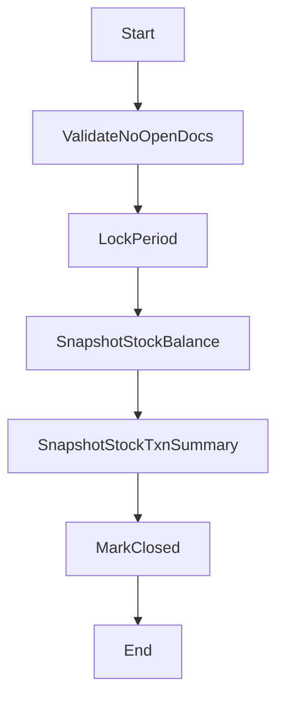

# 關帳流程（規格 + 完整骨架碼）

## 流程目的與邊界

對指定期間執行關帳：凍結過帳、彙總存量與成本結果，產生不可變更的期末快照。

## 流程圖



## 狀態機（建議）

- PeriodClose: `D -> P -> C`
  - `D`: 草稿
  - `P`: 執行中
  - `C`: 已關帳

## API 契約（建議）

- `POST /nx99/period-close/run`
- `GET /nx99/period-close/:id`

## 完整範例程式碼

```ts
@Injectable()
export class PeriodCloseFlowService {
  constructor(private readonly prisma: PrismaService, private readonly audit: AuditLogService) {}

  async run(body: RunPeriodCloseBody, ctx: Ctx) {
    const { tenantId, period } = body; // period: 2026-03
    if (!tenantId || !period) throw new BadRequestException('tenantId and period are required');

    const [year, month] = period.split('-').map(Number);
    const from = new Date(Date.UTC(year, month - 1, 1));
    const to = new Date(Date.UTC(year, month, 1));

    const result = await this.prisma.$transaction(async (tx) => {
      const openDocs = await tx.nx01Po.count({
        where: { tenantId, status: 'D', poDate: { gte: from, lt: to } },
      });
      if (openDocs > 0) throw new BadRequestException('open PO exists, cannot close period');

      const close = await tx.periodClose.create({
        data: {
          tenantId,
          period,
          status: 'P',
          startedAt: new Date(),
          createdBy: ctx.actorUserId ?? null,
          updatedBy: ctx.actorUserId ?? null,
        },
      });

      const balances = await tx.nx09StockBalance.findMany({ where: { tenantId } });
      if (balances.length > 0) {
        await tx.stockBalanceSnapshot.createMany({
          data: balances.map((b) => ({
            periodCloseId: close.id,
            tenantId,
            warehouseId: b.warehouseId,
            partId: b.partId,
            qty: b.qty,
          })),
        });
      }

      const txnSummary = await tx.nx09StockTxn.groupBy({
        by: ['partId', 'warehouseId'],
        where: { tenantId, occurredAt: { gte: from, lt: to } },
        _sum: { qtyDelta: true },
      });

      if (txnSummary.length > 0) {
        await tx.stockTxnSnapshot.createMany({
          data: txnSummary.map((s) => ({
            periodCloseId: close.id,
            tenantId,
            warehouseId: s.warehouseId,
            partId: s.partId,
            qtyDeltaSum: s._sum.qtyDelta ?? (0 as any),
          })),
        });
      }

      return tx.periodClose.update({
        where: { id: close.id },
        data: {
          status: 'C',
          finishedAt: new Date(),
          updatedBy: ctx.actorUserId ?? null,
        },
      });
    });

    await this.audit.write({
      actorUserId: ctx.actorUserId ?? null,
      moduleCode: 'NX99',
      action: 'CLOSE',
      entityTable: 'period_close',
      entityId: result.id,
      entityCode: result.period,
      summary: `Period close ${result.period}`,
      afterData: result,
      ipAddr: ctx.ipAddr ?? null,
      userAgent: ctx.userAgent ?? null,
    });

    return result;
  }
}
```

## 測試案例

- 有未結 PO 時禁止關帳。
- 關帳後產生快照資料。
- 同期間不可重複關帳（建議 unique: `tenantId + period`）。

